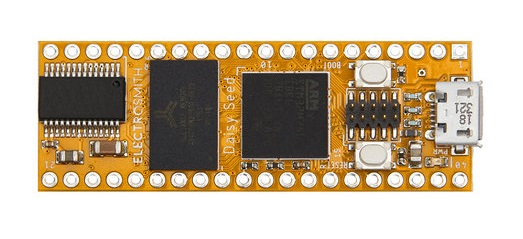

# DaisyFFT

### A program written on daisy seed - an embedded platform for creating music using a microcontroller. Allows you to connect audio input, performs a fast fourier transform on the audio signal in real time and modifies it.

